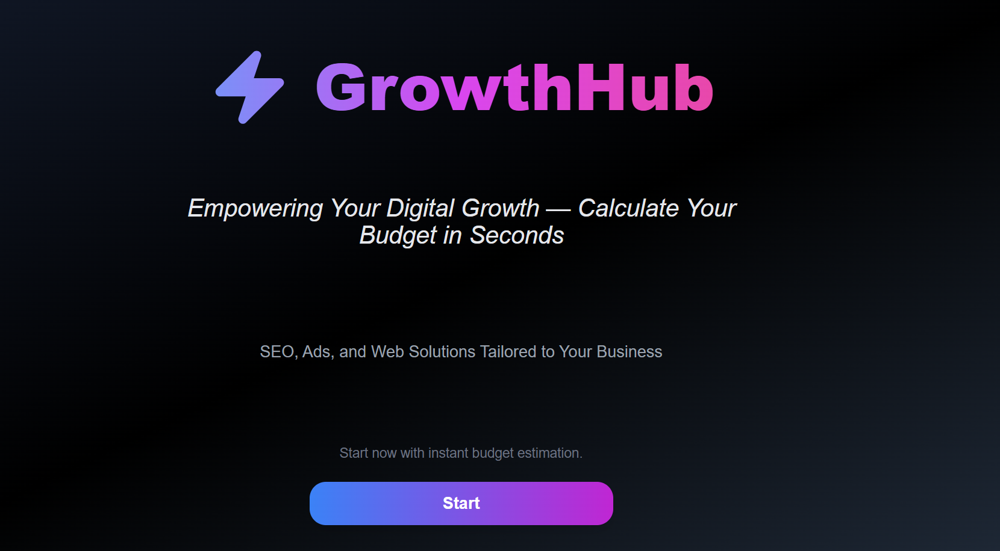
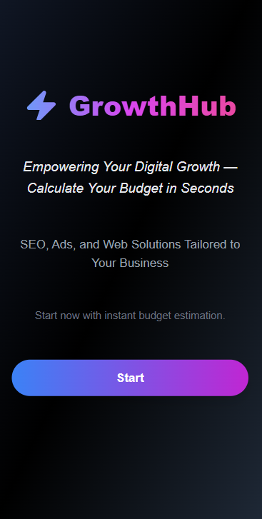

# ⚡ GrowthHub – Budget Calculator App

  


# 🌐 Visit demo

[](https://triflip.github.io/S6.Budgets/)

A web application to quickly and easily calculate digital budgets.  
It allows you to add clients with their data (name, phone, email), select services (SEO, Ads, Web, etc.), calculate totals, and manage the list of pending budgets.


## 🚀 Features
- Form to add budgets with field validation.
- Controlled inputs for name, phone, and email.
- Budget list with search and sorting (by client or by date).
- Modern design with **TailwindCSS** and reusable components.
- Navigation with **React Router**.
- Tests with **Vitest** and **Testing Library**.


## 🛠️ Tools used
- **React** – Library for building the UI.
- **TypeScript** – Static typing for more robustness.
- **Vite** – Ultra-fast bundler and dev server.
- **TailwindCSS** – Styling with utility-first CSS.
- **Vitest + Testing Library** – Testing framework.
- **Wave** – Accessibility tool to validate best practices.


## 📦 Local installation
1. Clone the repository:
   ```bash
   git clone https://github.com/triflip/S6.Budgets
   cd S6.Budgets
Install dependencies:

bash
npm install
Run in development mode:

bash
npm run dev
Open http://localhost:5173 in your browser.

## 🧠 Architecture decisions
- Feature-based folder structure.
- Separation between pages, features and shared UI.
- Controlled components for form handling.


📂 Project structure


## 🧪 Testing
Run the tests with:

bash
npm run test


## ♿ Accessibility
- Semantic HTML
- Keyboard navigation
- Color contrast validated with Wave

The project follows best practices with React + TypeScript + Tailwind for scalability and maintainability.